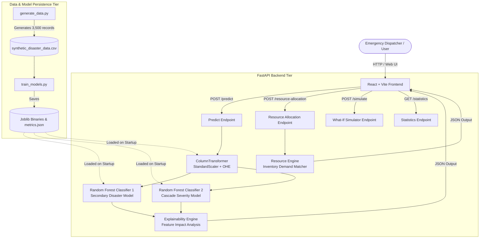

# Design and Development of an AI-Based Secondary Disaster Chain Reaction Management System Using Machine Learning

> An ML-powered disaster intelligence prototype that predicts potential secondary disaster risks, estimates severity, and recommends emergency resource allocation from environmental, demographic, and infrastructure conditions.

[](https://www.python.org/)
[](https://fastapi.tiangolo.com/)
[](https://scikit-learn.org/)
[](https://react.dev/)
[](https://vitejs.dev/)
[](https://tailwindcss.com/)
[](LICENSE)

---

## Overview

Natural disaster management is frequently complicated by **secondary disaster chain reactions**—cascading events where a primary disaster triggers severe secondary hazards. For instance, heavy rainfall can cause river basin inundation (flooding), saturate soil slopes (landslides), damage aging power grids (infrastructure failure), or contaminate standing water (disease outbreaks).

This project presents an end-to-end Emergency Operations Center (EOC) prototype designed for Machine Learning Project Based Learning (PBL). The system ingests environmental, geographical, infrastructure, and demographic parameters to:
1. Predict the most probable secondary disaster.
2. Estimate the cascade severity level.
3. Compute a composite risk score (0–100).
4. Provide transparent factor-level risk explanations.
5. Recommends resource allocation from available inventory pools.
6. Simulate "What-If" counterfactual scenarios to assist decision-makers in evaluating risk mitigation strategies.

---

## Problem Statement

When a primary disaster strikes, emergency response teams face significant operational hurdles:
- **Compound Multi-Hazard Risks**: Predicting whether heavy rainfall will manifest as flooding, landslides, or infrastructure collapse requires assessing multiple non-linear conditions simultaneously.
- **Resource Bottlenecks**: Distributing finite emergency supplies (Ambulances, Rescue Boats, Medical Kits, Shelters) without quantitative risk estimates often leads to misallocation or critical shortages.
- **Black-Box Decision Support**: Field commanders require transparent, factor-level explanations rather than uninterpretable prediction values.

This prototype addresses these challenges by combining machine learning classifiers, transparent explainability logic, resource demand calculation, and interactive counterfactual simulation within a unified dashboard interface.

---

## Objectives

- **Predict Secondary Disaster Risks**: Classify primary disaster conditions into five secondary disaster categories.
- **Estimate Cascade Severity**: Classify event impact across a 4-tier scale (`Low`, `Medium`, `High`, `Critical`).
- **Provide Class Probability Scores**: Output probability distributions for all secondary disaster classes.
- **Explain Important Risk Factors**: Generate transparent, factor-level impact explanations based on input thresholds and model feature importances.
- **Recommend Emergency Resource Allocation**: Compute required vs. available emergency equipment quantities and highlight inventory shortages.
- **Provide What-If Scenario Simulation**: Enable interactive sensitivity analysis to compare baseline and modified environmental conditions.
- **Visualize Model Performance**: Display empirical evaluation metrics, confusion matrices, and feature importances.

---

## Key Features

1. **Secondary Disaster Prediction**: Classifies input conditions into one of 5 secondary disaster types (`Flood`, `Landslide`, `Infrastructure Failure`, `Fire`, `Disease Outbreak`).
2. **Severity Prediction**: Assigns a 4-level severity rating (`Low`, `Medium`, `High`, `Critical`).
3. **Probability Distribution**: Returns full confidence probabilities for all target disaster classes.
4. **Composite Risk Score**: Calculates a normalized 0–100 risk index derived from prediction confidence, severity weight, and infrastructure vulnerability.
5. **Explainable Risk Factors**: Highlights top contributing features using model feature importances and transparent domain rules.
6. **Emergency Resource Allocation**: Calculates required quantities across 7 essential equipment categories.
7. **Resource Shortage Detection**: Automatically flags categories where required demand exceeds available inventory pools.
8. **What-If Simulator**: Interactive sliders allowing users to modify parameters (e.g. increasing rainfall from 100mm to 250mm) and observe real-time risk transitions.
9. **Model Performance Dashboard**: Displays accuracy, precision, recall, F1-scores, confusion matrix table, and feature importance rankings.
10. **Preconfigured Demo Scenarios**: 1-click test cases for quick evaluation (`Severe Flood Risk`, `Landslide Risk`, `Infrastructure Failure`).

---

## System Architecture



---

## Machine Learning Pipeline

```
Synthetic Data Generation (generate_data.py)
  └── 3,500 Records generated using domain physics & Gaussian noise
        │
        ▼
Data Preprocessing & Feature Encoding (train_models.py)
  ├── Numerical Scaling: StandardScaler()
  ├── Categorical Encoding: OneHotEncoder(handle_unknown='ignore')
  └── Train / Test Split: 80% Train / 20% Test (random_state=42)
        │
        ▼
Model Training & Evaluation
  ├── Secondary Disaster Model: RandomForestClassifier(n_estimators=120, max_depth=12)
  ├── Cascade Severity Model: RandomForestClassifier(n_estimators=100, max_depth=10)
  └── Metrics exported to backend/models/metrics.json
        │
        ▼
Model Persistence & API Serving (backend/app.py)
  └── Saved via joblib to backend/models/ for low-latency REST inference
```

---

## Dataset

> [!IMPORTANT]
> **Academic Notice**: The current dataset is **SYNTHETIC (3,500 records)** and intended strictly for academic prototype demonstration. It does not represent real-world emergency records.

### Input Features (11)

| Feature | Description | Type | Range / Scale |
| :--- | :--- | :---: | :--- |
| `rainfall_mm` | Cumulative 24-hour precipitation | Float | 0.0 – 380.0 mm |
| `river_level_m` | River gauge stage height above baseline | Float | 0.5 – 11.5 m |
| `soil_moisture` | Volumetric soil water saturation fraction | Float | 0.05 – 0.98 |
| `wind_speed_kmph` | Peak sustained wind speed | Float | 5.0 – 155.0 km/h |
| `temperature_c` | Ambient surface air temperature | Float | 14.0 – 48.0 °C |
| `population_density` | Human population concentration | Float | 100 – 18,000 /km² |
| `elevation_m` | Terrain height above sea level | Float | 5.0 – 2,400.0 m |
| `infrastructure_vulnerability` | Composite structural vulnerability index | Float | 0.05 – 0.95 |
| `road_accessibility` | Evacuation & emergency road access index | Float | 0.05 – 0.95 |
| `distance_to_water_body` | Distance to nearest river or coastline | Float | 0.1 – 25.0 km |
| `primary_disaster` | Primary trigger event category | String | Categorical |

### Target Variables (2)

| Target | Description | Classes |
| :--- | :--- | :--- |
| `secondary_disaster` | Primary secondary hazard predicted | `Flood`, `Landslide`, `Infrastructure Failure`, `Fire`, `Disease Outbreak` |
| `severity` | Estimated cascade severity level | `Low`, `Medium`, `High`, `Critical` |

---

## Model Details

### Model 1 — Secondary Disaster Classifier
- **Algorithm**: `RandomForestClassifier(n_estimators=120, max_depth=12, random_state=42)`
- **Target**: `secondary_disaster` (5 classes)

### Model 2 — Severity Classifier
- **Algorithm**: `RandomForestClassifier(n_estimators=100, max_depth=10, random_state=42)`
- **Target**: `severity` (4 classes)

*Why Random Forest?*
- Captures complex non-linear feature interactions (e.g. combined effects of high rainfall and low distance to water bodies).
- Invariant to monotonic feature scaling and robust against feature collinearity.
- Provides native Gini impurity feature importances for transparent model profiling.
- Fast execution for single-sample API inference.

---

## Model Evaluation

Metrics obtained on the 700 sample held-out test set (80/20 split):

| Model Target | Accuracy | Precision (Weighted) | Recall (Weighted) | F1 Score (Weighted) |
| :--- | :---: | :---: | :---: | :---: |
| **Secondary Disaster Classifier** | **92.4%** | **92.9%** | **92.4%** | **91.4%** |
| **Cascade Severity Classifier** | **82.4%** | **84.1%** | **82.4%** | **80.9%** |

*Note: Evaluation metrics are derived from the synthetic dataset.*

- **Accuracy**: Percentage of test instances correctly classified.
- **Precision**: Proportion of positive predictions that were correct.
- **Recall**: Proportion of actual positive instances correctly identified.
- **F1 Score**: Harmonic mean of Precision and Recall.

---

## Confusion Matrix

Secondary Disaster Classifier confusion matrix evaluated on 700 held-out test samples:

| Actual \ Predicted | Disease Outbreak | Fire | Flood | Infrastructure Failure | Landslide |
| :--- | :---: | :---: | :---: | :---: | :---: |
| **Disease Outbreak** | **2** | 5 | 12 | 2 | 0 |
| **Fire** | 0 | **180** | 1 | 2 | 0 |
| **Flood** | 0 | 0 | **200** | 20 | 0 |
| **Infrastructure Failure** | 0 | 4 | 0 | **144** | 1 |
| **Landslide** | 0 | 6 | 0 | 0 | **121** |

---

## Explainability

The prototype provides transparent factor-level explanations by combining Random Forest Gini feature importances with domain-inspired rules (`backend/explainability.py`).

Example explanations generated by the API:
- *"Heavy rainfall (280.0 mm) significantly increases inundation and flash flood risks."*
- *"High river gauge level (9.5 m) approaches critical flood stage threshold."*
- *"Extremely high soil moisture saturation (92%) severely undermines slope stability."*
- *"High infrastructure vulnerability (70%) amplifies cascade structural damage."*

---

## Resource Allocation

The resource engine (`backend/resource_engine.py`) matches predicted disaster demands against a static inventory pool across 7 equipment categories:

- **Ambulances**
- **Rescue Teams**
- **Medical Kits**
- **Rescue Boats**
- **Water Units**
- **Food Packages**
- **Temporary Shelters**

Demand is calculated using severity multipliers, population density scaling, and risk scores:

$$\text{Demand}_r = \text{Round}\left( \text{BaseDemand}_{r, d} \times \text{SevMult}_s \times \sqrt{\frac{\text{PopDensity}}{3500}} \times \sqrt{\frac{\text{RiskScore}}{65}} \right)$$

If $\text{Required}_r > \text{Available}_r$, a **Critical Shortage** alert is triggered.

---

## What-If Simulator

The What-If Simulator allows users to adjust environmental parameters (Rainfall, River Level, Soil Moisture, Wind Speed, Infrastructure Vulnerability, Road Access) using interactive sliders. The UI compares Baseline Scenario A against Simulated Scenario B in real time, demonstrating risk score deltas (e.g. +19 points shift) and severity level transitions.

---

## Demo Scenarios

Preconfigured test cases included in the UI:

### Scenario 1 — Severe Flood Risk
- **Primary Event**: Heavy Rain
- **Inputs**: Rainfall = 280 mm, River Level = 9.5 m, Soil Moisture = 92%, Pop Density = 9,500/km²
- **Output**: **Flood** (High/Critical Severity, Risk Score ~81)

### Scenario 2 — Landslide Risk
- **Primary Event**: Landslide Trigger
- **Inputs**: Elevation = 850 m, Soil Moisture = 88%, Road Access = 25%, Rainfall = 180 mm
- **Output**: **Landslide** (High Severity, Risk Score ~81)

### Scenario 3 — Infrastructure Failure
- **Primary Event**: Cyclone
- **Inputs**: Wind Speed = 115 km/h, Infrastructure Vulnerability = 85%, Pop Density = 12,000/km²
- **Output**: **Infrastructure Failure** (Critical Severity, Risk Score ~88)

---

## Technology Stack

| Layer | Technology | Version | Purpose |
| :--- | :--- | :--- | :--- |
| **Frontend** | React | 18.3.1 | Single-Page Application framework |
| **Build Tool** | Vite | 6.0.7 | Frontend build tool & dev server |
| **Styling** | Tailwind CSS | 3.4.17 | Emergency Operations Center styling |
| **Charts** | Recharts | 2.15.0 | Data visualization & probability charts |
| **Icons** | Lucide React | 0.469.0 | Dashboard iconography |
| **Backend** | FastAPI | 0.141.1 | Python ASGI REST API server |
| **Machine Learning** | scikit-learn | 1.9.1 | Preprocessing & Random Forest models |
| **Data Science** | pandas, NumPy | 3.0 / 2.5 | Data manipulation & synthetic generation |
| **Persistence** | joblib | 1.6.0 | Serialization of models & scaler pipelines |
| **Language** | Python / JavaScript | 3.12 / ES6+ | Core codebase languages |

---

## Project Structure

```
Disaster-Resource-Allocation-ML/
├── backend/
│   ├── data/
│   │   └── synthetic_disaster_data.csv   # 3,500 synthetic disaster records
│   ├── models/
│   │   ├── disaster_model.joblib         # Secondary disaster RF classifier
│   │   ├── severity_model.joblib         # Severity RF classifier
│   │   ├── preprocessor.joblib           # StandardScaler & OneHotEncoder
│   │   └── metrics.json                  # Model evaluation metrics & confusion matrix
│   ├── app.py                            # FastAPI main application & endpoints
│   ├── explainability.py                 # Feature impact explanation engine
│   ├── generate_data.py                  # Synthetic dataset generator
│   ├── resource_engine.py                # Resource allocation & inventory matcher
│   └── train_models.py                   # ML training & evaluation script
├── docs/
│   ├── api.md                            # REST API reference manual
│   ├── architecture.md                   # Software architecture blueprint
│   └── methodology.md                    # Machine learning pipeline methodology
├── frontend/
│   ├── src/
│   │   ├── components/
│   │   │   ├── Footer.jsx                # Academic disclaimer footer
│   │   │   └── Navbar.jsx                # EOC top navigation & live badge
│   │   ├── pages/
│   │   │   ├── DashboardPage.jsx         # Realtime dashboard
│   │   │   ├── ModelPage.jsx             # Model analytics & metrics
│   │   │   ├── PredictPage.jsx           # Inference predictor page
│   │   │   ├── ResourcesPage.jsx         # Resource allocation table
│   │   │   └── SimulatorPage.jsx         # What-If scenario simulator
│   │   ├── services/
│   │   │   └── api.js                    # API HTTP client
│   │   ├── App.jsx                       # Main application router
│   │   ├── index.css                     # Global Tailwind styles
│   │   └── main.jsx                      # React DOM root entry point
│   ├── index.html                        # HTML template
│   ├── package.json                      # Frontend dependencies
│   ├── tailwind.config.js                # Tailwind EOC color palette
│   └── vite.config.js                    # Vite dev server & proxy settings
├── app.py                                # Root wrapper for FastAPI app
├── generate_data.py                      # Root wrapper for data generator
├── train_models.py                       # Root wrapper for model training
├── package.json                          # Root package script runner
├── requirements.txt                      # Python dependencies
├── LICENSE                               # MIT License
└── README.md                             # Main project documentation
```

---

## Installation

### Prerequisites
- **Python**: Version 3.10 or higher
- **Node.js**: Version 18.0 or higher
- **Git**: Installed on system

### Setup Instructions

1. **Clone the Repository**
   ```bash
   git clone https://github.com/Madhesh-J007/Disaster-Resource-Allocation-ML.git
   cd Disaster-Resource-Allocation-ML
   ```

2. **Create Python Virtual Environment (Windows)**
   ```cmd
   python -m venv .venv
   .venv\Scripts\activate
   ```

3. **Install Backend Dependencies**
   ```cmd
   pip install -r requirements.txt
   ```

4. **Install Frontend Dependencies**
   ```cmd
   npm install
   ```

---

## Running the Project

### 1. Generate Dataset & Train Models
```bash
# Generate 3,500 synthetic disaster records
python generate_data.py

# Train Random Forest classifiers & export model binaries
python train_models.py
```

### 2. Start FastAPI Backend Server
```bash
python app.py
# Or run with Uvicorn directly:
# uvicorn app:app --reload
```
*Backend API will run at: `http://127.0.0.1:8000`*

### 3. Start React Frontend Server
In a separate terminal tab:
```bash
npm run dev
```
*Frontend UI will open at: `http://localhost:5173`*

---

## API Documentation

FastAPI provides an interactive OpenAPI Swagger UI accessible at `http://127.0.0.1:8000/docs`.

| Method | Endpoint | Purpose |
| :--- | :--- | :--- |
| `GET` | `/health` | Check service health and dataset status |
| `POST` | `/predict` | Run secondary disaster prediction and explanations |
| `GET` | `/statistics` | Fetch model evaluation metrics and confusion matrix |
| `POST` | `/resource-allocation` | Compute required vs available resource inventory |
| `POST` | `/simulate` | Compare baseline vs modified scenario risks |
| `GET` | `/demo-scenarios` | Retrieve preconfigured demo test cases |

---

## Example Prediction

### API Request (`POST /predict`)
```json
{
  "rainfall_mm": 280.0,
  "river_level_m": 9.5,
  "soil_moisture": 0.92,
  "wind_speed_kmph": 20.0,
  "temperature_c": 24.0,
  "population_density": 9500.0,
  "elevation_m": 15.0,
  "infrastructure_vulnerability": 0.70,
  "road_accessibility": 0.60,
  "distance_to_water_body": 0.3,
  "primary_disaster": "Heavy Rain"
}
```

### Representative Response
```json
{
  "primary_disaster": "Heavy Rain",
  "predicted_secondary_disaster": "Flood",
  "secondary_disaster_probability": 0.8533,
  "severity": "High",
  "severity_probability": 0.9675,
  "risk_score": 81,
  "class_probabilities": {
    "Disease Outbreak": 0.0512,
    "Fire": 0.0,
    "Flood": 0.8533,
    "Infrastructure Failure": 0.0955,
    "Landslide": 0.0
  },
  "explanation": [
    "Heavy rainfall (280.0 mm) significantly increases inundation and flash flood risks.",
    "High river gauge level (9.5 m) approaches critical flood stage threshold.",
    "Extremely high soil moisture saturation (92%) severely undermines slope stability.",
    "High infrastructure vulnerability (70%) amplifies cascade structural damage."
  ],
  "top_contributing_factors": [
    { "feature": "rainfall_mm", "value": 280.0, "impact": "Critical Driver" },
    { "feature": "river_level_m", "value": 9.5, "impact": "Critical Driver" },
    { "feature": "soil_moisture", "value": 0.92, "impact": "Critical Driver" },
    { "feature": "infrastructure_vulnerability", "value": 0.7, "impact": "Critical Driver" }
  ]
}
```

---

## Interface

The dashboard includes 5 primary functional pages:
1. **Dashboard (`/dashboard`)**: Overview stats cards (Total scenarios, Top secondary risk, Model accuracy), 1-click Demo Scenarios, Secondary Disaster Bar Chart, Severity Distribution Pie Chart, and Recent Incidents Log.
2. **Predictor (`/predict`)**: Input form for environmental conditions, preset buttons, class probability breakdown chart, severity gauge, factor explanations, and resource allocation shortcut.
3. **Resource Allocation (`/resources`)**: Scenario parameter controls, Required vs Available vs Allocated inventory table, shortage warning highlights, and utilization progress bars.
4. **What-If Simulator (`/simulator`)**: Interactive parameter sliders, baseline (A) vs modified (B) scenario cards, risk score delta summary, and comparative bar chart.
5. **ML Analytics (`/model`)**: Dataset size overview, Random Forest model performance cards (Accuracy, Precision, Recall, F1), 5x5 confusion matrix table, and feature importance chart.

---

## Limitations

- **Synthetic Dataset**: Trained on 3,500 synthetically generated records; performance reflects mathematical rule consistency rather than empirical disaster sensor readings.
- **Static Resource Pool**: Emergency resource inventories are static local snapshots rather than real-time GPS-tracked fleet feeds.
- **Prototype Scope**: Designed as an academic proof-of-concept for PBL demonstration and should not be deployed for real-world emergency decision-making.

---

## Future Scope

- **Real-Time Weather Integration**: Ingest live meteorological feeds (e.g. IMD / OpenWeather map API).
- **Geospatial GIS Mapping**: Integrate Leaflet / Mapbox spatial vector layers for district-level risk mapping.
- **IoT & Sensor Feeds**: Connect real-time river stage and soil moisture sensor streams.
- **Dynamic Routing**: Implement Mixed Integer Linear Programming (MILP) or Reinforcement Learning for emergency vehicle route optimization.

---

## Academic Context

This project was developed as a **Project Based Learning (PBL)** project for the Machine Learning course.

---

## Disclaimer

This project is an academic prototype. The dataset is synthetic and predictions should not be used for real-world emergency decision-making. Real deployment would require validated historical disaster data, domain expert validation, live data sources, rigorous testing, and appropriate safety certification.

---

## License

Distributed under the MIT License. See [LICENSE](LICENSE) for more information.
