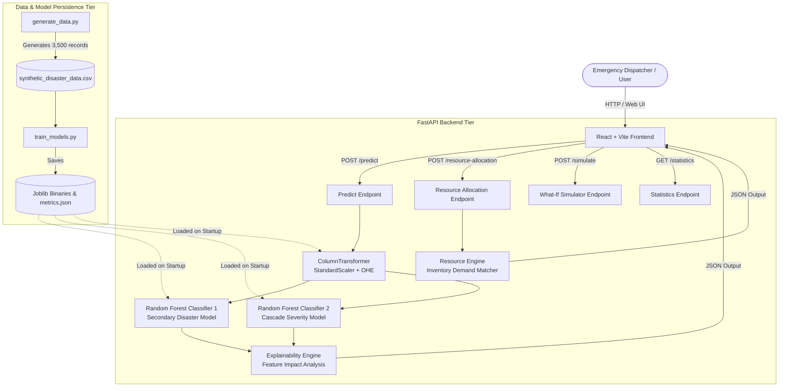

# System Architecture & Technical Design

This document details the software architecture, data flow, component interactions, and execution lifecycle of the **AI-Based Secondary Disaster Chain Reaction Management System**.

---

## 1. System Overview

The application is structured as a decoupled, multi-tier system:
1. **Frontend Presentation Tier**: React 18 single-page application built with Vite and Tailwind CSS.
2. **Backend Services Tier**: Python 3.12 FastAPI server providing RESTful endpoints.
3. **ML & Analytics Tier**: Scikit-Learn Random Forest models, preprocessor pipelines, and rule-assisted feature impact explainability.
4. **Data Persistence Tier**: Local CSV synthetic feature store and Joblib serialized model artifacts.

---

## 2. Component Descriptions

### 2.1 Presentation Tier (React + Vite)
- **Framework**: React 18 with Vite 6 build toolchain.
- **Styling**: Tailwind CSS with custom dark Emergency Operations Center (EOC) color palette (`#0b0f19` base, `#151c2e` card panels, high-contrast severity badges).
- **Data Visualization**: Recharts (`BarChart`, `PieChart`, responsive containers).
- **Icons**: Lucide React (`ShieldAlert`, `Activity`, `Boxes`, `Sliders`, `Cpu`).
- **Page Routing**: Single-Page App tab state routing (`/dashboard`, `/predict`, `/resources`, `/simulator`, `/model`).

### 2.2 API Gateway Tier (FastAPI)
- **Framework**: FastAPI (ASGI server powered by Uvicorn).
- **Validation**: Pydantic v2 schemas enforcing type constraints and numerical ranges (e.g. `rainfall_mm >= 0`, `soil_moisture` in `[0.0, 1.0]`).
- **CORS**: Middleware configured to allow cross-origin requests from the React development server (`http://localhost:5173`).

### 2.3 Machine Learning Pipeline Tier
- **Synthetic Data Generator** (`backend/generate_data.py`): Synthesizes 3,500 records using domain-inspired formula weighting and Gaussian noise.
- **Model Training Pipeline** (`backend/train_models.py`): Fits `StandardScaler` on numerical features, `OneHotEncoder` on `primary_disaster`, splits data 80/20 (`random_state=42`), and trains two `RandomForestClassifier` models.
- **Explainability Engine** (`backend/explainability.py`): Generates transparent factor-level explanations by combining input parameter z-scores and Random Forest feature importances.
- **Resource Engine** (`backend/resource_engine.py`): Dynamically matches predicted disaster demand against a synthetic available inventory pool (Ambulances, Rescue Teams, Medical Kits, Rescue Boats, Water Units, Food Packages, Temporary Shelters).

---

## 3. Data Flow Lifecycle

1. **Input Stage**: The user enters 11 environmental/geographical/demographic parameters or selects a preconfigured demo scenario.
2. **Preprocessing**: The FastAPI server receives the JSON payload and transforms input using the saved `ColumnTransformer` (`preprocessor.joblib`).
3. **Inference**:
   - Secondary Disaster model computes class probabilities across all 5 target classes (`Flood`, `Landslide`, `Infrastructure Failure`, `Fire`, `Disease Outbreak`).
   - Severity model predicts categorical severity (`Low`, `Medium`, `High`, `Critical`).
   - Composite `risk_score` (10–99) is derived from prediction confidence, severity level, and infrastructure vulnerability.
4. **Post-Processing & Response**:
   - Feature explanations and top contributing factors are appended.
   - Resource allocation recommendations are computed if requested.
   - JSON payload is transmitted to the React UI for rendering.
